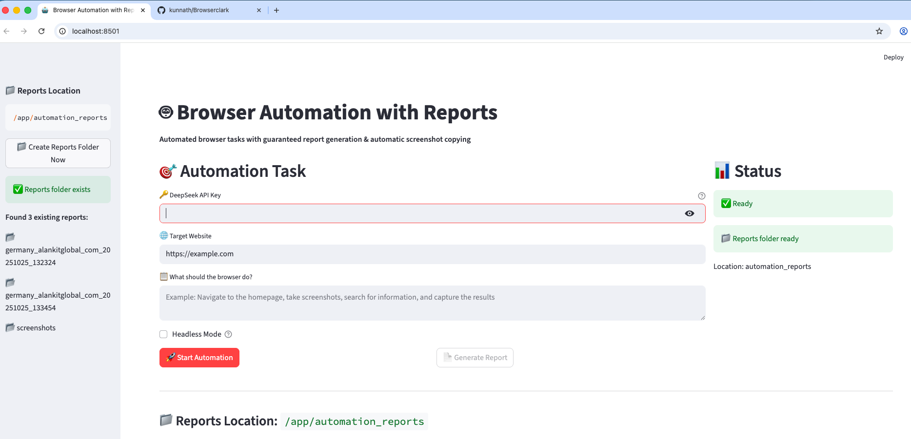

# Python Docker App

This project is a Dockerized Python application that includes two main scripts: `app.py` and `copyreport.py`. The application is designed to run a Streamlit web interface for a browser agent and manage file operations related to automation reports.

## Features (Initial Release)

- **Streamlit UI** for easy task input and status monitoring
- **Automated browser tasks** using AI agents (DeepSeek API supported)
- **Automatic screenshot capture** at every major step
- **Comprehensive HTML and JSON reports** generated after each run
- **Demo mode** with simulated screenshots if browser automation is unavailable
- **Organized folder structure** for all reports and screenshots
- **Automatic management** of screenshots and report files
- **Status updates** and error handling in the UI

## Demo



## How It Works

1. Fill in the form with your DeepSeek API key, target website, and task description.
2. Click "Start Automation" to begin the browser task.
3. Watch status updates in the sidebar.
4. Screenshots are automatically captured and organized.
5. Generate and view your report with all screenshots and results.
6. Access all files in the `automation_reports` folder.

## Output

- **HTML Report**: Visual summary of the automation run
- **JSON Data**: Machine-readable results and metadata
- **Screenshots**: All images captured during automation
- **Organized Folders**: Timestamped directories for each run

## Project Structure

```
python-docker-app
├── demo
│   ├── requirements.txt       # Lists the dependencies required for the Python programs
│   ├── app.py  # Streamlit application for the browser agent
│   └── copyreport.py          # Script to copy files to the automation_reports directory
├── Dockerfile                  # Dockerfile to build the application image
└── README.md                   # Documentation for the project
```

## Requirements

The dependencies for the project are specified in the `demo/requirements.txt` file. Ensure that all necessary packages for running the scripts are included.

## Docker Setup

To build and run the Docker container for this application, follow these steps:

1. **Build the Docker Image:**
   Navigate to the project directory and run the following command:
   ```
   docker build -t python-docker-app .
   ```

2. **Run the Docker Container:**
   After building the image, you can run the container using:
   ```

   docker run -v "$(pwd)/demo/automation_reports:/app/automation_reports" -p 8501:8501 python-docker-app
   ```

   This command will start the Streamlit application, which can be accessed at `http://localhost:8501`.

## Usage

- **Streamlit Application:** The `streamlit_browser_agent_test_async.py` script provides a web interface for interacting with the browser agent.
- **File Operations:** The `copyreport.py` script is responsible for copying files from the agent run folder to the `automation_reports` directory.

## Contributing

Contributions to the project are welcome. Please feel free to submit issues or pull requests for any improvements or bug fixes.

## License

This project is licensed under the MIT License. See the LICENSE file for more details.# Browserclark
